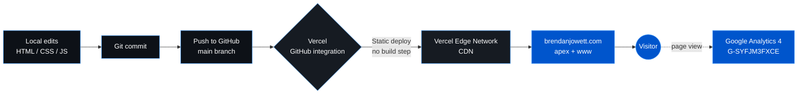

# brendanjowett.com

Source code for [brendanjowett.com](https://brendanjowett.com) — the personal bio site for Brendan Jowett, founder of [INFLATE AI](https://www.inflate.agency/).

It's a single-page static site: vanilla HTML, CSS, and JavaScript. No build step, no framework, no backend. The animated background is a small canvas particle network rendered client-side.

## Stack

- **Markup / styling** — plain HTML5 + hand-written CSS (Inter via Google Fonts)
- **Interactivity** — vanilla JavaScript (no frameworks)
- **Background animation** — HTML5 `<canvas>` particle network ([network.js](network.js))
- **Hosting** — [Vercel](https://vercel.com) (static deploy, no build step)
- **DNS** — `brendanjowett.com` apex + `www` pointed at Vercel
- **Analytics** — Google Analytics 4

## Build & Deploy



Pushes to `main` are picked up by Vercel's GitHub integration and deployed straight to the edge — there is no build command (see [vercel.json](vercel.json)), the repo root is served as-is.

## Files

| File | Purpose |
|------|---------|
| [index.html](index.html) | Page markup, social links, CTA buttons, sponsorship modal |
| [style.css](style.css) | Theme, layout, animations |
| [script.js](script.js) | Modal + copy-to-clipboard behaviour |
| [network.js](network.js) | Canvas particle-network background |
| [vercel.json](vercel.json) | Static-deploy config (clean URLs, no build) |
| [assets/](assets/) | Profile image |

## Local preview

Any static server works. With Node installed:

```bash
npx serve .
```

Then open the printed URL.

## License

All rights reserved. Personal site — feel free to read the code, but please don't lift the design wholesale.
