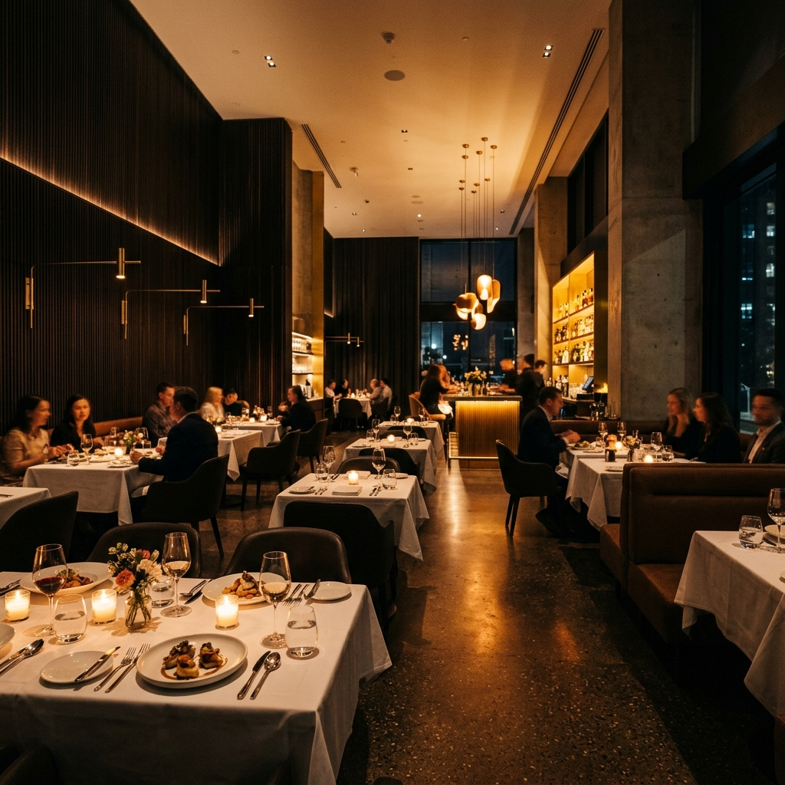

# MenuSite - Premium Restaurant Website Builder 🍽️

## English
MenuSite is a premium landing page and website builder service tailored specifically for high-end restaurants, cafes, and pizzerias. Designed with a modern, glassmorphism aesthetic and a sleek dark mode interface, it focuses on driving conversions and capturing high-value leads.

### Features
- **Premium Dark Mode UI**: Specifically crafted to highlight food photography and luxury ambiance.
- **RTL Optimized**: Full Right-to-Left (RTL) support for Hebrew content.
- **Interactive Lead Capture**: A dynamic, scrollable modal form for clients to upload logos, menus, up to 5 site images, and select their brand colors.
- **Horizontal Portfolio Gallery**: Modern swipeable/scrollable showcase of latest projects.
- **Responsive Design**: Fully optimized for mobile, tablet, and desktop viewing.

---

## עברית
מנוסייט (MenuSite) הוא שירות פרימיום לבניית אתרים ודפי נחיתה למסעדות יוקרה, בתי קפה ופיצריות. המערכת מעוצבת בסגנון מודרני, עם ממשק Dark Mode מרשים שמטרתו להמיר גולשים ללקוחות.

### מאפיינים מרכזיים
- **עיצוב פרימיום**: נבנה במיוחד כדי להבליט צילומי אוכל ואווירת יוקרה.
- **תמיכה מלאה ב-RTL**: התאמה מושלמת לשפה העברית ולכיווניות ימין-לשמאל.
- **טופס אינטראקטיבי לקליטת לקוחות**: קופסה קופצת (Modal) מתקדמת המאפשרת ללקוחות להעלות לוגו, תפריט, עד 5 תמונות של המסעדה ולבחור את צבעי המותג שלהם.
- **גלריית עבודות נגללת**: תצוגת קרוסלה אופקית מודרנית להצגת הפרויקטים האחרונים.
- **רספונסיביות מלאה**: מותאם בצורה חלקה למובייל, טאבלט ודסקטופ.
