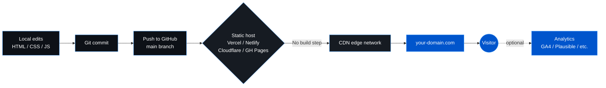

# Personal Website

A clean, single-page personal bio site you can clone, edit, and deploy in under ten minutes. Vanilla HTML, CSS, and JavaScript — no build step, no framework, no backend. Drop in your own photo, links, and copy and you're done.

The animated background is a small canvas particle network rendered client-side, with floating tech-icon accents and CTA button styles designed to look at home for builders, founders, and creators.

## Stack

- **Markup / styling** — plain HTML5 + hand-written CSS (Inter via Google Fonts)
- **Interactivity** — vanilla JavaScript, zero dependencies
- **Background animation** — HTML5 `<canvas>` particle network ([network.js](network.js))
- **Hosting** — [Vercel](https://vercel.com) (static deploy, no build step) — works just as well on Netlify, Cloudflare Pages, GitHub Pages, or any static host
- **Analytics (optional)** — Google Analytics 4 snippet wired into [index.html](index.html); swap or remove the measurement ID

## Build & Deploy



Pushes to `main` are picked up by your static host's GitHub integration and deployed straight to the edge — there is no build command (see [vercel.json](vercel.json)), the repo root is served as-is.

## Files

| File | Purpose |
|------|---------|
| [index.html](index.html) | Page markup, social links, CTA buttons, contact modal |
| [style.css](style.css) | Theme, layout, animations |
| [script.js](script.js) | Modal + copy-to-clipboard behaviour |
| [network.js](network.js) | Canvas particle-network background |
| [vercel.json](vercel.json) | Static-deploy config (clean URLs, no build) |
| [assets/](assets/) | Profile image — replace with your own |

## Quick start

```bash
git clone https://github.com/brendanjowett/personal-website.git my-site
cd my-site
npx serve .
```

Then open the printed URL.

## Make it yours

1. **Profile image** — replace the file in [assets/](assets/) with your own (square, at least 220×220) and update the `` in [index.html](index.html).
2. **Favicons** — swap `favicon.ico`, `favicon-32.png`, and `apple-touch-icon.png`.
3. **Name, tagline, label** — edit the `bio-section` block in [index.html](index.html).
4. **Social links** — update the `href`s in the `social-icons` block (YouTube, LinkedIn, X, Instagram, email).
5. **CTA buttons** — edit the `cta-buttons` block. Each button is a colour variant (`cta-dark`, `cta-blue`, `cta-orange`, `cta-purple`, `cta-green`) defined in [style.css](style.css).
6. **Contact modal** — change the email address in [index.html](index.html) and the `navigator.clipboard.writeText` call in [script.js](script.js).
7. **Meta / SEO** — update `<title>`, `<meta name="description">`, and the Open Graph tags at the top of [index.html](index.html).
8. **Analytics** — replace the GA4 measurement ID in [index.html](index.html), or delete the `<!-- Google Analytics -->` block entirely.
9. **Theme colours** — tweak the `:root` CSS variables at the top of [style.css](style.css).

## Deploy

### Vercel
1. Push your fork to GitHub.
2. Import the repo on [vercel.com](https://vercel.com).
3. No build command, no output directory changes — accept the defaults.
4. Add a custom domain in the project's **Domains** tab.

### Other hosts
The repo is plain static files — drag the folder into Netlify Drop, point Cloudflare Pages at it, or push to a `gh-pages` branch. No configuration needed.

## License

MIT — clone it, edit it, ship it.
